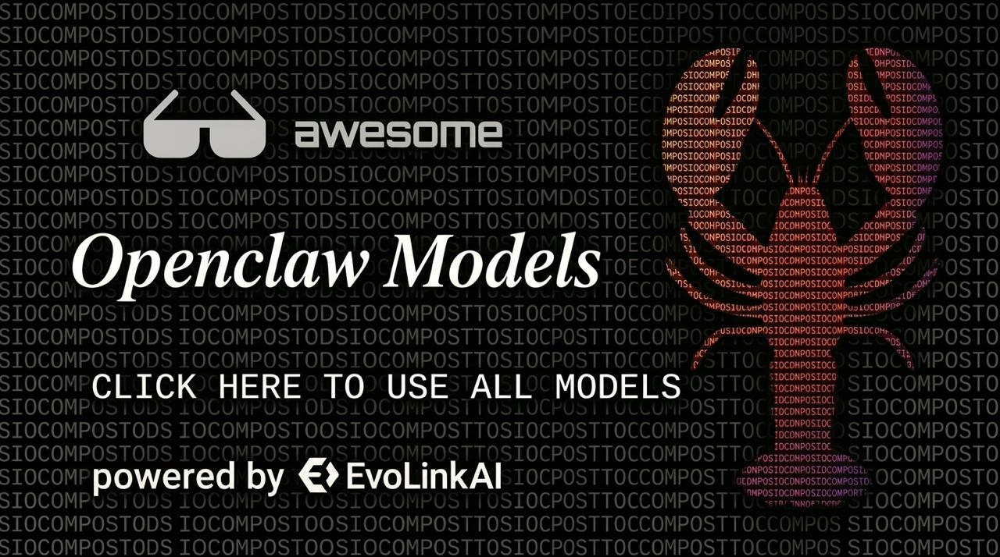

# OpenClaw 模型列表

[](https://evolink.ai/minimax-m2-5)

> 精選頂級 AI 模型合集，提供開箱即用的 OpenClaw 配置。

<p align="center">
  <strong>🌐 Languages：</strong>
  <a href="README.md">English</a> |
  <a href="README-zh-CN.md">简体中文</a> |
  <a href="README-zh-TW.md">繁體中文</a> |
  <a href="README-es.md">Español</a> |
  <a href="README-ja.md">日本語</a> |
  <a href="README-ko.md">한국어</a> |
  <a href="README-tr.md">Türkçe</a> |
  <a href="README-fr.md">Français</a> |
  <a href="README-de.md">Deutsch</a> |
  <a href="README-ru.md">Русский</a>
</p>

---

## 介紹

本倉庫列出了所有可與 OpenClaw 集成的主流 AI 模型，按廠商分類整理。每個模型都附帶可直接複製使用的配置文件。

**支持的廠商：**
- 🟣 Anthropic (Claude)
- 🔵 Google (Gemini)
- 🟢 OpenAI (GPT)
- 🟡 ByteDance (Doubao)
- 🌙 Moonshot (Kimi)

---

## 模型列表

### 🟣 Anthropic (Claude)

| 模型 | ID | 配置文件 |
|-------|----|----------|
| Claude Opus 4.6 | `anthropic/claude-opus-4-6` | [claude-opus-4-6.md](models/anthropic/claude-opus-4-6.md) |
| Claude Sonnet 4.6 | `anthropic/claude-sonnet-4-6` | [claude-sonnet-4-6.md](models/anthropic/claude-sonnet-4-6.md) |
| Claude Opus 4.5 | `anthropic/claude-opus-4-5-20251101` | [claude-opus-4-5.md](models/anthropic/claude-opus-4-5.md) |
| Claude Opus 4.1 | `anthropic/claude-opus-4-1-20250805` | [claude-opus-4-1.md](models/anthropic/claude-opus-4-1.md) |
| Claude Sonnet 4.5 | `anthropic/claude-sonnet-4-5-20250929` | [claude-sonnet-4-5.md](models/claude-sonnet-4-5.md) |
| Claude Sonnet 4 | `anthropic/claude-sonnet-4-20250514` | [claude-sonnet-4.md](models/claude-sonnet-4.md) |
| Claude Haiku 4.5 | `anthropic/claude-haiku-4-5-20251001` | [claude-haiku-4-5.md](models/claude-haiku-4-5.md) |

### 🔵 Google (Gemini)

| 模型 | ID | 配置文件 |
|-------|----|----------|
| Gemini 3.1 Flash Lite | `google/gemini-3.1-flash-lite-preview` | [gemini-3-1-flash-lite.md](models/google/gemini-3-1-flash-lite.md) |
| Gemini 3.1 Pro | `google/gemini-3.1-pro-preview` | [gemini-3-1-pro.md](models/google/gemini-3-1-pro.md) |
| Gemini 2.5 Pro | `google/gemini-2.5-pro` | [gemini-2-5-pro.md](models/google/gemini-2-5-pro.md) |
| Gemini 2.5 Flash | `google/gemini-2.5-flash` | [gemini-2-5-flash.md](models/google/gemini-2-5-flash.md) |
| Gemini 3.0 Pro | `google/gemini-3-pro-preview` | [gemini-3-0-pro.md](models/gemini-3-0-pro.md) |
| Gemini 3.0 Flash | `google/gemini-3-flash-preview` | [gemini-3-0-flash.md](models/gemini-3-0-flash.md) |

### 🟢 OpenAI (GPT)

| 模型 | ID | 配置文件 |
|-------|----|----------|
| GPT-5.4 | `openai/gpt-5.4` | [gpt-5-4.md](models/openai/gpt-5-4.md) |
| GPT-5.2 | `openai/gpt-5.2` | [gpt-5-2.md](models/openai/gpt-5-2.md) |
| GPT-5.1 | `openai/gpt-5.1` | [gpt-5-1.md](models/openai/gpt-5-1.md) |
| GPT-5.1 Chat | `openai/gpt-5.1-chat` | [gpt-5-1-chat.md](models/openai/gpt-5-1-chat.md) |
| GPT-5.1 Thinking | `openai/gpt-5.1-thinking` | [gpt-5-1-thinking.md](models/openai/gpt-5-1-thinking.md) |

### 🟡 ByteDance (Doubao)

| 模型 | ID | 配置文件 |
|-------|----|----------|
| Doubao Seed 2.0 Pro | `bytedance/doubao-seed-2.0-pro` | [doubao-seed-2-0-pro.md](models/bytedance/doubao-seed-2-0-pro.md) |
| Doubao Seed 2.0 Lite | `bytedance/doubao-seed-2.0-lite` | [doubao-seed-2-0-lite.md](models/bytedance/doubao-seed-2-0-lite.md) |
| Doubao Seed 2.0 Mini | `bytedance/doubao-seed-2.0-mini` | [doubao-seed-2-0-mini.md](models/bytedance/doubao-seed-2-0-mini.md) |
| Doubao Seed 2.0 Code | `bytedance/doubao-seed-2.0-code` | [doubao-seed-2-0-code.md](models/bytedance/doubao-seed-2-0-code.md) |

### 🌙 Moonshot (Kimi)

| 模型 | ID | 配置文件 |
|-------|----|----------|
| Kimi K2 Thinking | `moonshot/kimi-k2-thinking` | [kimi-k2-thinking.md](https://evolink.ai/kimi-k2-thinking) |
| Doubao Seed 2.0 | `bytedance/seed-2-0` | [seed-2-0.md](https://evolink.ai/seed-2-0) |

---

## 使用方法

### 前置要求
1. **Node.js 22+** — [下載地址](https://nodejs.org/en/download)
2. **EvoLink API Key** — [免費註冊取得](https://evolink.ai/signup?utm_source=github&utm_medium=readme&utm_campaign=openclaw-models-list)

### 步驟 1：安裝 OpenClaw

```bash
npm install -g openclaw@latest
```

### 步驟 2：配置模型

編輯 `~/.openclaw/openclaw.json`，添加對應的廠商配置。每個模型文件中已包含完整的複製貼上配置。

> ⚠️ 針對 Gemini 模型，`baseUrl` 必須包含 `/v1beta` 後綴，否則會出現 `403 Forbidden` 錯誤。

### 步驟 3：設置默認模型

```bash
openclaw models set <provider>/<model-id>
```

### 步驟 4：重啟並驗證

```bash
openclaw gateway restart
openclaw gateway status
openclaw agent --agent main -m "hi" --json
```

📖 完整配置指南：[docs.evolink.ai](https://docs.evolink.ai/en/integration-guide/openclaw?utm_source=github&utm_medium=readme&utm_campaign=openclaw-models-list)
